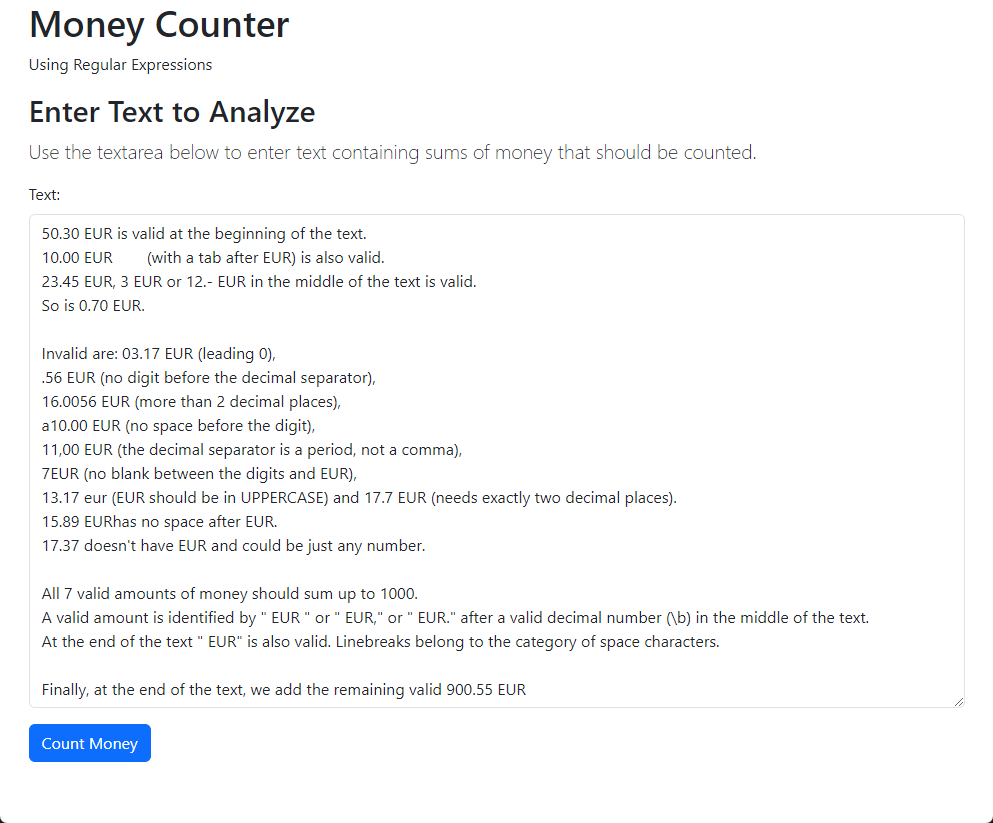
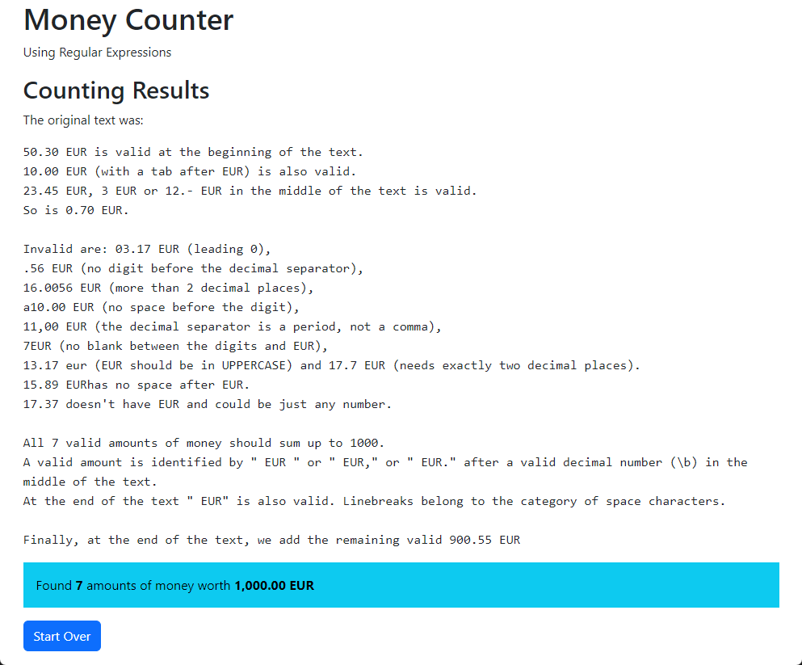

# Übung 1 – PHP-Grundlagen und Regular Expressions

HYP2UE_T1 Hypermedia 2 Serverseitige Programmierung | 04.03.2024 | Wolfgang Hochleitner | Abgabe

Die erste Übung dient zum Kennenlernen der serverseitigen Skriptsprache PHP und von regulären Ausdrücken (regular Expressions oder Regex). In ein Formular wird ein Text eingegeben, der an mehreren Stellen Geldbeträge enthält. Manche in korrekten Formaten, manche in inkorrekten. Nach dem Absenden des Formulars sollen die korrekt formatierten Geldbeträge erkannt und summiert werden. Die Summe wird zusammen mit dem eingegebenen Text angezeigt.

## Repository clonen

Clonen Sie im ersten Schritt das Repository ihres GitHub-Classroom-Teams, damit sie lokal (im Docker-Container) damit arbeiten können. Verwenden Sie dazu PhpStorm ("Get from VCS") oder einen Git-Client Ihrer Wahl.

Clonen Sie das Repository in das `webapp`-Verzeichnis des Docker-Containers, sodass das Projekt im Verzeichnis `webapp/ue01-YourTeamName` zu liegen kommt.

Sie arbeiten in dieser Übung gemeinsam am Projekt, d.h. gemeinsam im `main`-Branch. Falls sie möchten, können sie auch mit Branches arbeiten, d.h. eine Person legt sich einen Branch an und hat somit eine separate Codebasis, die zu einem späteren Zeitpunkt in den `main`-Branch gemerged werden kann. Für den Anfang ist es aber vermutlich einfacher, sich einfach abzusprechen, wer am Beispiel arbeitet, um Merge-Konflikte zu vermeiden. Hat eine Person committed und den Code auf GitHub gepushed, so muss die zweite zunächst einen Pull ausführen, um die aktuellste Version zu erhalten.

## Geld zählen mit regular Expressions

Sie finden in ihrem Repository drei Dateien, die zum Übungsbeispiel gehören:

- `index.html`: Die Startseite, in der das Formular zur Texteingabe erstellt und das die PHP-Seite zur Verarbeitung aufrufen soll.
- `moneycounter.php`: Die PHP-Datei wird nach Absenden des Formulars aufgerufen und erhält den eingegebenen Text. Dort wird die regular Expression angewandt, um die Geldbeträge herauszufiltern, zu summieren und auszugeben.
- `teststring.txt`: Enthält die Zeichenkette, mit der getestet werden soll. Die korrekten Geldbeträge darin ergeben genau 1.000 EUR.

### Die HTML-Datei (`index.html`)

Die HTML-Datei enthält bereits ein grobes HTML-Grundgerüst mit einem Container, Überschriften und etwas Text. Erstellen Sie darin nun ein Formular mit einer `<textarea>`, die mehrzeilige Eingaben erlaubt. Das Eingabefeld soll ein Label besitzen und einen Submit-Button zum Absenden aufweisen.

Das Formular soll mit der Methode `POST` angeschickt werden und die PHP-Datei `moneycounter.php` aufrufen. In ihr steht dann der eingegebene Text zur Verarbeitung zur Verfügung.

💡 Tipp: Fügen Sie den zu analysierenden Text aus `teststring.txt` zwischen `<textarea>` und `</textarea>` ein. Auf diese Weise ist das Eingabefeld bereits vorausgefüllt und Sie können leichter testen.

Wenn Sie möchten, können Sie das Formularfeld mit Bootstrap-Klassen formatieren. Das Framework ist bereits eingebunden und stellt Klassen für Formularfelder zur Verfügung: `form-control` für Eingabefelder, `form-label` für Labels und `btn btn-primary` für einen Button.

Die folgende Abbildung zeigt das Formular mit Text vor dem Absenden.

|  |
|:-------------------------------------------------------------------------------------------------------------:|
|   **Im Formular wird der Test-String eingetragen. Mit Klick auf den Button wird die PHP-Datei aufgerufen.**   |

### Die PHP-Datei (`moneycounter.php`)

Die PHP-Datei wird vom HTML-Formular aufgerufen und erhält den eingegebenen Text im superglobalen Array `$_POST`. Fragen Sie diesen Text ab und speichern Sie ihn in einer Variable.

Erstellen Sie sich nun eine Variable, die die Summe der Geldbeträge beinhaltet.

Schreiben Sie nun eine regular Expression, die alle gültigen Geldbeträge findet (siehe dazu den Abschnitt [Gültige Formate](#gültige-formate)). Wenden Sie den regulären Ausdruck mit `preg_match_all()` an, damit Sie alle Vorkommen im Text zurückgeliefert bekommen. Setzen Sie in ihrer Regex so Klammern, dass Sie die Beträge aus dem `$matches`-Array (dritter Parameter von `preg_match_all()`) auslesen können.

Summieren Sie nun die gefundenen, korrekten Beträge und geben Sie die Summe mit `echo` aus. Formatieren Sie die Zahl mit `number_format()` so, dass zwei Nachkommastellen angezeigt werden, als Dezimaltrennzeichen der Punkt (`.`) und als Tausendertrennzeichen ein Komma (`,`) angezeigt wird.

Geben Sie weiters den Originaltext noch aus. Die folgende Abbildung zeigt das Ergebnis.

|  |
|:--------------------------------------------------------------------------------------------------------------:|
|  **Nachdem das Formular abgeschickt wurde, werden auf der PHP-Seite der Originaltext und Summe ausgegeben.**   |

### Gültige Formate

Gültige Geldbeträge sind Dezimalzahlen ohne oder mit genau zwei Nachkommastellen oder einem Bindestrich. Das Dezimaltrennzeichen ist der Punkt (`.`). Die Zahl vor dem Dezimaltrennzeichen kann beliebig groß sein (von 0 weg ist alles möglich). Nach dem Dezimaltrennzeichen dürfen nur eine zweistellige Zahl oder ein Bindestrich stehen. Als Währungssymbol soll nur „EUR“ in genau dieser Schreibweise erkannt werden. Geldbeträge können am Anfang und Ende der Zeichenkette sowie in der Mitte stehen. In der Mitte muss ein Abstand (Leerzeichen) zu den vorigen und nachfolgenden Zeichen gegeben sein.

Beispiele für korrekte Formate:

- 12 EUR
- 123.- EUR
- 3.50 EUR

### Ungültige Formate

- .50 EUR (keine Zahl vor dem Dezimaltrennzeichen)
- 12.5 EUR (nur eine Nachkommastelle)
- 13.1743 EUR (zu viele Nachkommastellen)
- 24.50EUR (kein Leerzeichen zwischen Betrag und EUR)
- 2,70 EUR (Komma statt Punkt als Dezimaltrennzeichen)
- 12,50 eur (EUR kleingeschrieben)

## Beispielprojekt: Datumsumwandlung

Im Verzeichnis `examples` ihres Repositories finden Sie ein Beispiel zur Datumsumwandlung. Sie können dieses Beispiel ausprobieren und analysieren, um zu sehen, wie mithilfe von regulären Ausdrücken und der Funktion `preg_match()` ein Muster in einer Zeichenkette gesucht und das Ergebnis verwendet wird. Öffnen Sie dazu `index.html` in ihrem Docker-Container: http://localhost:8080/ue01-YourTeamName/examples/index.html (sie müssen `ue01-YourTeamName` durch den Namen ihres Teams auf GitHub ersetzen, damit der Link funktioniert).

In der Datei `README.md` im Verzeichnis `examples` finden Sie eine ausführliche Erklärung des Beispiels.

## Tipps und Richtlinien

- [regex101](https://regex101.com/) und [PHP Live Regex](https://www.phpliveregex.com/) sind praktische Seiten, um regular Expressions bzw. deren Ergebnisse schnell zu testen.
- Achten Sie darauf, dass Sie korrektes HTML erzeugen. Validieren Sie den entstandenen Quellcode mit dem W3C Validator.
- Verwenden Sie das [PHP Manual](https://www.php.net/manual/de/) zum Nachschlagen von PHP-Funktionen.
- Bei Fragen oder Problemen zur Aufgabe eröffnen Sie ein Issue in ihrem Repository.
